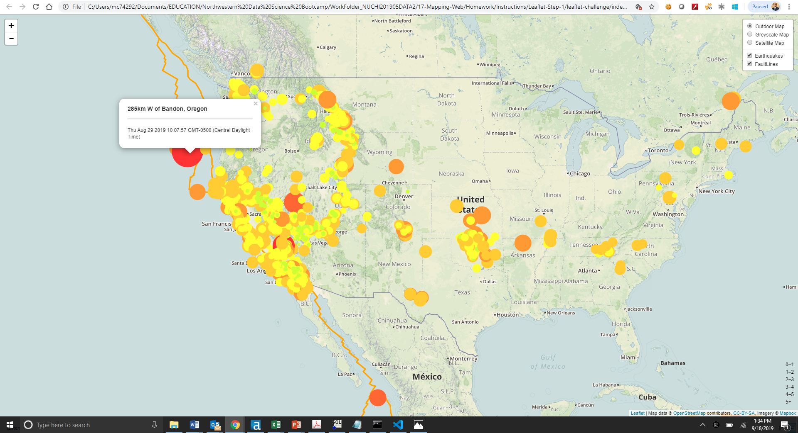
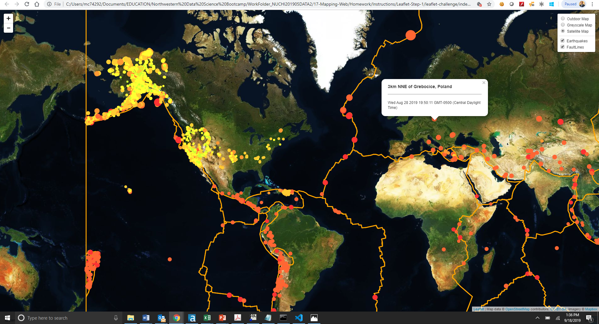

# leaflet-challenge
Visualizing Data with Leaflet

# United States Geological Survey - Last 30 Day Earthquake Maps

Please add your API key to the config.js file located in static/js file path before opening the index.html file.

This demostrates how Leaflet.js is used to visualize geoJSON data. The javascript uses Leaflet layer control using basemaps and overlay maps using a live API feed provided by the USGS(United States Geological Survey). The data includes all earthquake data for the Past 30 Days. Additional layer of tectonic plates provides the relationship between tectonic plates and seismic activites.

Please refer below for the a screenshots of the visualizations. 

